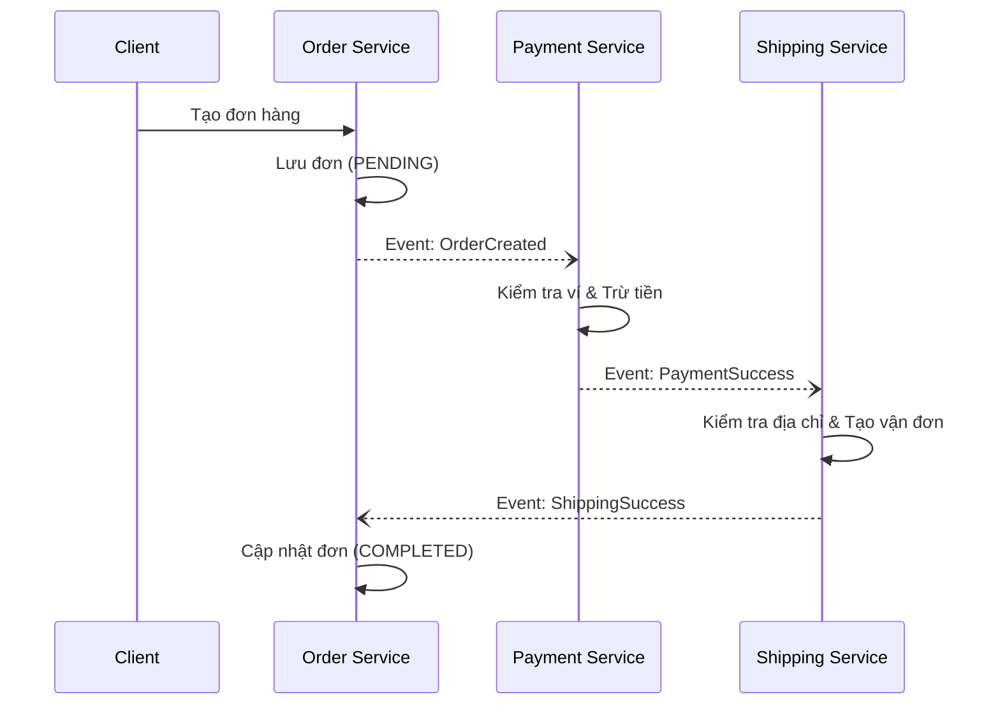
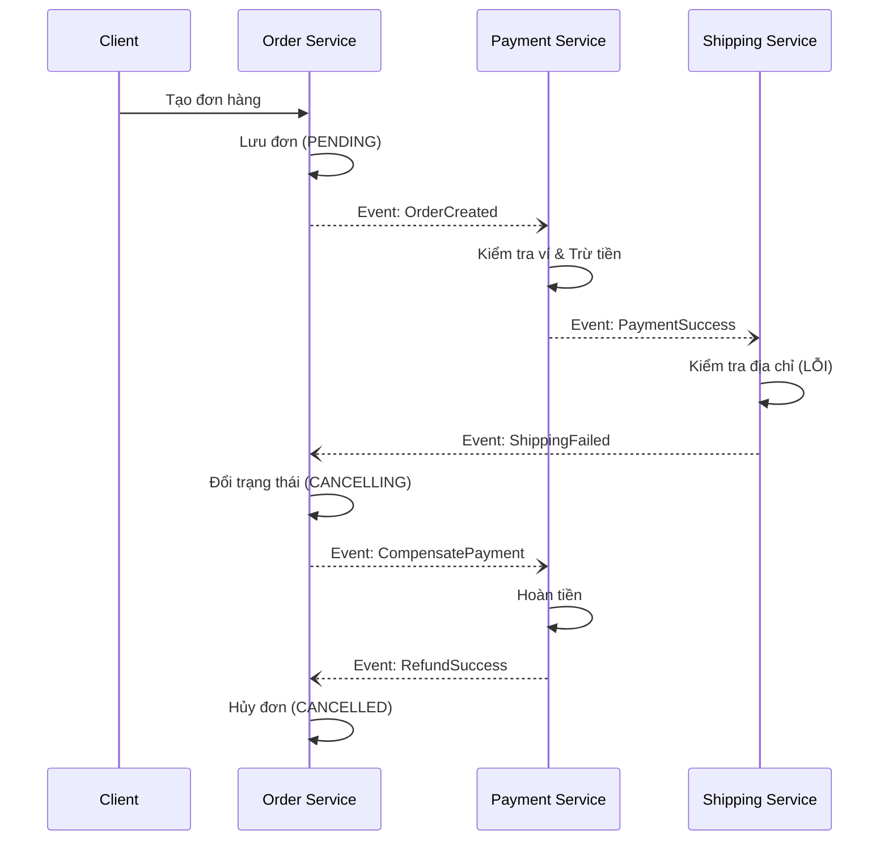
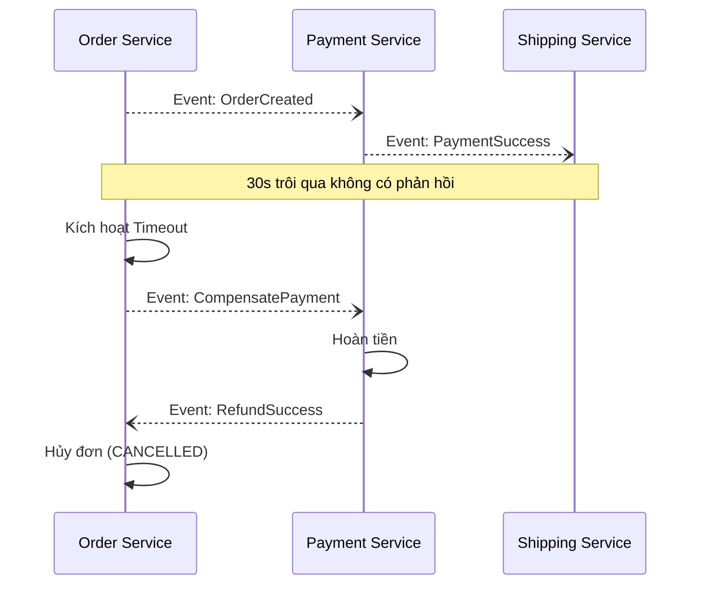

# BÀI TẬP 3: THIẾT KẾ VŨ ĐIỆU CHOREOGRAPHY SAGA

## 1. Phân tích I/O (Input/Output)

**Input:**
- **Thông tin khách hàng:** ID khách hàng, họ tên, email.
- **Ví tiền:** Số dư hiện tại, ID ví (liên kết với Payment Service).
- **Tồn kho:** Trạng thái còn hàng (đơn giản hóa trong ví dụ này).
- **Thông tin đơn hàng:** ID sản phẩm, số lượng, địa chỉ giao hàng, tổng tiền.

**Output (Trạng thái cuối cùng của 3 dịch vụ):**
- **Trường hợp thành công:**
  - Order Service: Đơn hàng ở trạng thái `COMPLETED` (hoàn thành).
  - Payment Service: Giao dịch thanh toán được ghi nhận (trừ tiền thành công).
  - Shipping Service: Vận đơn được tạo thành công, trạng thái `SHIPPING_CREATED`.
- **Trường hợp thất bại (do Shipping):**
  - Order Service: Đơn hàng ở trạng thái `CANCELLED` (đã hủy).
  - Payment Service: Giao dịch hoàn tiền được ghi nhận (số dư ví được phục hồi).
  - Shipping Service: Giao hàng thất bại (hoặc không hỗ trợ địa chỉ).

## 2. Lưu đồ (Flowchart)

### a) Luồng xử lý thành công

### b) Luồng bù trừ (Shipping thất bại)

### c) Cơ chế Timeout (Phản hồi chậm từ Shipping)

- Order Service sẽ có một Job hoặc Timer theo dõi các đơn hàng ở trạng thái `PENDING` (sau khi đã PaymentSuccess mà chưa nhận được ShippingSuccess).
- Nếu quá 30 giây không nhận được phản hồi từ Shipping Service:
  - Order Service tự động đánh dấu đơn hàng là `TIMEOUT_SHIPPING`.
  - Order Service phát sự kiện `CompensatePayment` để hoàn tiền cho khách.
  - Payment Service thực hiện hoàn tiền và gửi `RefundSuccess`.
  - Order Service hủy đơn hàng.

## 3. Mã nguồn mô phỏng

Mã nguồn được cung cấp trong thư mục dự án (sử dụng Node.js với cơ chế Event Emitter để mô phỏng Message Broker). Có các file riêng biệt cho từng service và một file chạy chính để mô phỏng luồng thành công và luồng thất bại.
